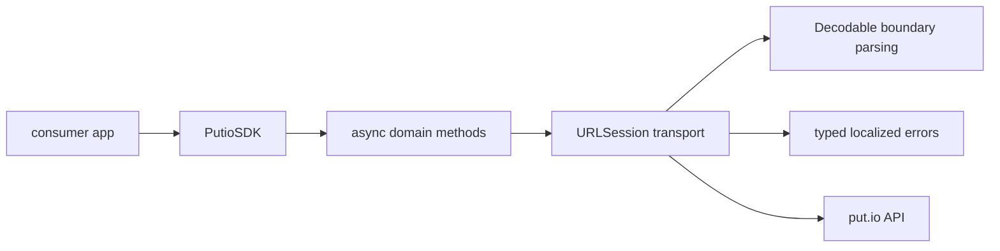

# SDK Overview

## Goal

Explain the actual `putio-sdk-swift` package shape for humans and agents.

## System View

## Components

| Component | Responsibility |
| --- | --- |
| `PutioSDK` | shared SDK entrypoint and transport composition |
| Async methods | preferred modern API surface using `async throws` |
| Boundary models | `Decodable` request and response types for the modernized domains |
| Error model | typed transport, API, and decoding failures with `LocalizedError` guidance |

## Design Rules

- prefer native Swift concurrency over callback-first transport code
- parse external data at the boundary with `Decodable`
- keep the CocoaPods and Swift Package surfaces aligned
- preserve forward compatibility where possible instead of crashing on unknown backend strings
- keep live-tested domains on the modern async path first, then expand outward
- keep the public API single-surface and async-first instead of splitting effort across compatibility wrappers

## Current Modernized Slice

- `account`
  - `getAccountInfo`
  - `getAccountSettings`
  - `saveAccountSettings`
  - `clearAccountData`
  - `destroyAccount`
- `auth`
  - `getAuthCode`
  - `checkAuthCodeMatch`
  - `logout`
  - `validateToken`
  - `generateTOTP`
  - `verifyTOTP`
  - `getRecoveryCodes`
  - `regenerateRecoveryCodes`
- `grants`
  - `getGrants`
  - `revokeGrant`
  - `linkDevice`
- `history`
  - `getHistoryEvents`
  - `clearHistoryEvents`
  - `deleteHistoryEvent`
- `files`
  - `getFiles`
  - `getFile`
  - `searchFiles`
  - `continueFileSearch`
  - `createFolder`
  - `deleteFiles`
  - `copyFiles`
  - `moveFiles`
  - `renameFile`
  - `findNextFile`
  - `setFileSort`
  - `resetFileSort`
  - `getStartFrom`
  - `setStartFrom`
  - `resetStartFrom`
  - `getMp4ConversionStatus`
  - `startMp4Conversion`
- `routes`
  - `getRoutes`
- `subtitles`
  - `getSubtitles`
- `transfers`
  - `listTransfers`
  - `continueTransfers`
  - `getTransfer`
  - `countTransfers`
  - `getTransferInfo`
  - `addTransfer`
  - `addTransfers`
  - `cancelTransfers`
  - `cleanTransfers`
  - `retryTransfer`
- `trash`
  - `listTrash`
  - `continueListTrash`
  - `restoreTrashFiles`
  - `deleteTrashFiles`
  - `emptyTrash`

## Native Baseline Coverage

| Baseline family | Swift coverage |
| --- | --- |
| Auth and OAuth | `covered` |
| Account basics and settings | `covered` |
| Security and 2FA | `covered` |
| Files browse and detail | `covered` |
| Search with cursor continuation | `covered` |
| Transfers | `covered` |
| History and events | `covered` |
| Trash with cursor continuation | `covered` |
| Subtitles | `covered` |
| Playback-adjacent helpers | `covered` |

Typed query inputs exist for account info, account settings updates, file listing, file detail projections, file search and continuation, transfer listing, and trash listing. Cursor or continuation flows stay explicit where the backend exposes them.

## What This Package Is Not

- not a generic JSON bag around the put.io API
- not an Alamofire-first design anymore
- not full namespace parity with the TypeScript SDK yet
- not a dual-surface SDK with callback compatibility as a first-class goal
