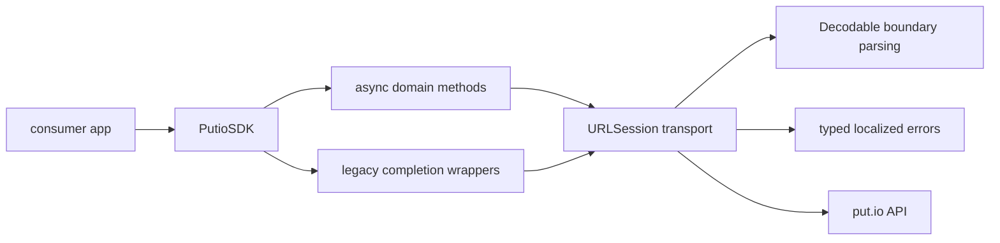

# SDK Overview

## Goal

Explain the actual `putio-sdk-swift` package shape for humans and agents.

## System View

## Components

| Component | Responsibility |
| --- | --- |
| `PutioSDK` | shared SDK entrypoint and transport composition |
| Async methods | preferred modern API surface using `async throws` |
| Legacy wrappers | compatibility layer for completion-handler call sites |
| Boundary models | `Decodable` request and response types for the modernized domains |
| Error model | typed transport, API, and decoding failures with `LocalizedError` guidance |

## Design Rules

- prefer native Swift concurrency over callback-first transport code
- parse external data at the boundary with `Decodable`
- keep the CocoaPods and Swift Package surfaces aligned
- preserve forward compatibility where possible instead of crashing on unknown backend strings
- keep live-tested domains on the modern async path first, then expand outward
- treat completion-handler APIs as compatibility wrappers rather than the architectural center

## Current Modernized Slice

- `account`
  - `getAccountInfo`
  - `getAccountSettings`
- `auth`
  - `getAuthCode`
  - `checkAuthCodeMatch`
  - `validateToken`
  - `generateTOTP`
  - `verifyTOTP`
  - `getRecoveryCodes`
  - `regenerateRecoveryCodes`
- `grants`
  - `getGrants`
  - `revokeGrant`
  - `linkDevice`
- `history`
  - `getHistoryEvents`
  - `clearHistoryEvents`
  - `deleteHistoryEvent`
- `files`
  - `getFiles`
  - `getFile`
  - `searchFiles`
  - `continueFileSearch`
  - `createFolder`
  - `deleteFiles`
  - `getStartFrom`
  - `setStartFrom`
  - `resetStartFrom`
  - `getMp4ConversionStatus`
  - `startMp4Conversion`
- `routes`
  - `getRoutes`
- `subtitles`
  - `getSubtitles`
- `trash`
  - `listTrash`
  - `continueListTrash`
  - `restoreTrashFiles`
  - `deleteTrashFiles`

## What This Package Is Not

- not a generic JSON bag around the put.io API
- not an Alamofire-first design anymore
- not full namespace parity with the TypeScript SDK yet
- not a promise to keep callback-heavy internals as the long-term architecture
